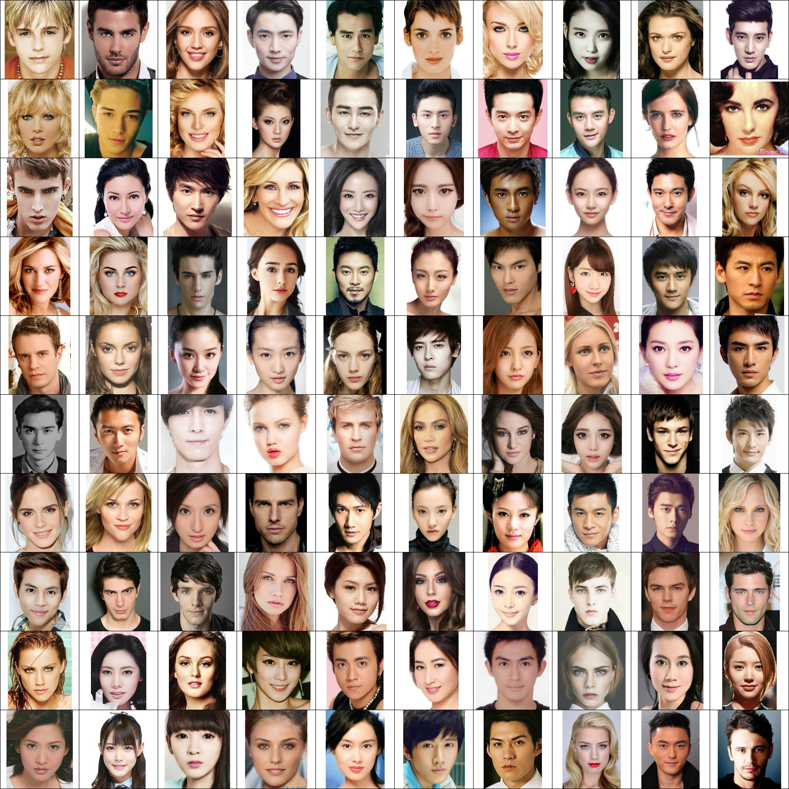
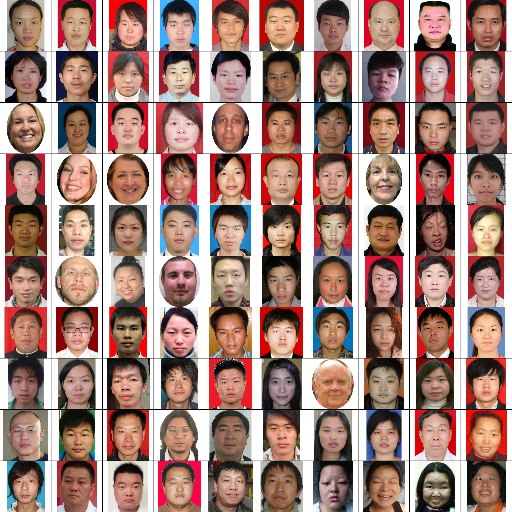

# AI_Model
## Run model

Before running the model, make sure that sample images are in `./samples`. Also, download model checkpoint from [here](https://drive.google.com/file/d/1tm6HcMsWaTM-naqQDJeTpNXckgXS0UrL/view?usp=sharing) and place it in `./checkpoints`. To predict the attractiveness score, run:

```python
python3 test.py --gpu_ids 0 --test_dataroot ./samples --output_dir ./output/your_root --ckpt ./checkpoints/8000.pth
```

The results are saved in `./output/your_root/output.txt`.

## Results
### Images with the highest attractiveness scores

### Images with the lowest attractiveness scores

